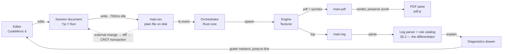
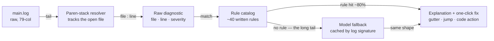
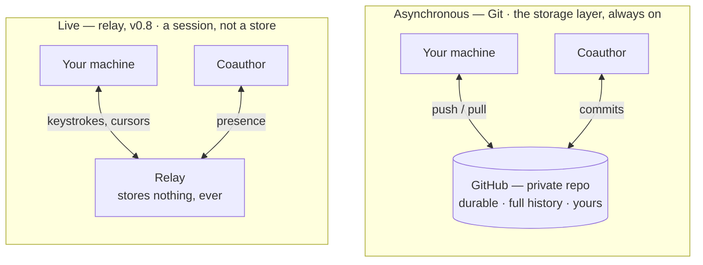

# Abstract-Tex — Design Document

**Rev A · 8 September 2026 · Pre-sprint 1**

A local-first LaTeX editor for people who write papers, not servers.

This is the reference document for sprint planning and development loops. It fixes the
architecture, names the non-goals, and sequences sixteen sprints from an empty repository to a
v1.0 release. Everything here is revisable — but revise it here first, then in code.

| | |
|---|---|
| **Status** | Pre-sprint 1 |
| **Roadmap** | 16 sprints (~7.5 months full-time; double it solo and part-time) |
| **Licence** | AGPL-3.0 for the app; MIT for the extracted libraries (`texlog` from S6.5) |
| **Platforms** | Windows · macOS · Linux |

---

## 1. What we are building, and what we refuse to build

> Overleaf's core problem is not its feature list. It is that compilation happens on someone
> else's computer.

Every frustration downstream of that is structural, not a bug someone forgot to fix. A shared
compile server means a queue. A queue means latency you cannot optimise away from the client. It
means a compile-time cap on the free tier, a timeout on your thesis, and no work at all on a
train. It means your manuscript — often the single most valuable file you own — lives in a
database you do not administer.

Move compilation to the machine the author is already sitting at and the entire class of problem
evaporates. Not improves: evaporates. That is the whole thesis. Everything else in this document
is a consequence of it.

The related mistake is bundling. Overleaf is three products fused into one: an editor, a
compiler, and a filestore — and you cannot take one without the other two. We unbundle them. The
editor is local, the compiler is local, and the filestore is **a Git remote you already own**, on
GitHub or anywhere else that speaks Git. Each piece is replaceable, and none of them is us.

### 1.1 The second problem: the editor is thin

Once latency is solved, the remaining complaint is that a browser textarea with syntax colouring
is not a writing environment. Three things are missing, and they are the same three things every
serious LaTeX user works around with a pile of external tools:

- **Errors are shown, not explained.** `! Missing $ inserted.` is a true statement that tells a
  first-time author nothing. TeX's log format is from 1982 and reads like it.
- **Citations live somewhere else.** Zotero in one window, a `.bib` in another, a DOI on a
  publisher's page in a third. The cost is measured in tab-switches per paragraph.
- **Prose gets no help.** Not autocomplete for `\begin` — help with the sentence. Tightening,
  consistency, the reviewer's comment you don't understand.

So: compile locally, then spend the whole remaining budget on the editing experience. That is the
product.

### 1.2 Locked decisions

Four forks were settled before this draft. They are load-bearing; changing one invalidates large
parts of what follows.

| Decision | Choice | Consequence |
|---|---|---|
| **Shape** | Local-first desktop app | No accounts, no billing, no compile workers, no untrusted-TeX sandbox. Ships as an installer. |
| **Source format** | Pure `.tex`, always | Zero conversion risk, full package ecosystem, byte-identical journal submission. All product value is in the editing layer — nothing is spent on a format bridge. |
| **Remote storage** | Git, pushed to GitHub | No filestore of our own to build, secure, back up or pay for. Backup, cross-device sync, history and async coauthoring all fall out of one mechanism the user already controls. See §5.7. |
| **Collaboration** | Architected now, shipped at v0.8 | The document model is a CRDT from sprint 1. Costs roughly two days now; costs a rewrite and a data migration later. |
| **"Smart" means** | Error translation, citations, AI prose assistant | Three concrete subsystems (§5.2, §5.4, §5.5) rather than an ambient aspiration. |

### 1.3 Non-goals

Read this list at the start of every sprint planning session. It is the only defence against the
failure mode that kills projects like this one.

- **Not a WYSIWYG LaTeX editor.** Rendering-as-you-type against real TeX semantics is a
  decade-long research problem that has consumed better-funded teams. We show a PDF next to
  source. That is the deal.
- **Not a TeX distribution.** We bundle an engine and detect existing ones. We do not maintain
  package archives, mirrors, or a `tlmgr` competitor.
- **Not a cloud service.** We store nothing. Remote copies live in *your* Git remote, under your
  account, revocable by you. The optional live relay at v0.8 is a self-hostable binary that
  persists nothing — not a business.
- **Not a Zotero or Git replacement.** Both are excellent and entrenched. We integrate deeply and
  reimplement nothing.
- **Not a semantic PDF library.** Explicitly deferred. Embedding and indexing a personal paper
  library is a product of its own — revisit after v1.0, if at all.
- **Not mobile.** No phone, no tablet, no responsive editor. Nobody writes a methods section on a
  phone.

---

## 2. Six commitments that settle arguments

When a design question comes up mid-sprint and there is no obvious answer, resolve it against
these in order rather than by taste.

**Plain files are the truth.** A `.tex` file on disk is always the authoritative state. Any
editor, any script, any `grep` can read it. Uninstalling this application leaves your paper
completely intact and completely normal. No database, no proprietary container, no export step.
This is non-negotiable and it constrains the CRDT design in §5.6.

**Latency is the feature.** Not a quality, the feature. Every proposal is evaluated against
keystroke-to-pixel time. Two budgets, enforced in CI: **<16 ms** from keypress to glyph, **<2 s**
p95 for a warm incremental recompile. A feature that breaches either does not ship until it
doesn't.

**Never show a raw log.** The `.log` file is an implementation detail of TeX, not a user
interface. Every diagnostic surfaced to the author is translated into a sentence about their
document. The raw log stays one click away, forever, for the people who want it — but it is never
the default and never the only thing offered.

**Zero setup to first PDF.** Install, open a `.tex`, see a PDF. No TeX distribution to install
first, no PATH to configure, no engine to choose. The five gigabytes and forty minutes that a TeX
Live install costs a newcomer is the single largest reason people stay on Overleaf, and we delete
it.

**Keyboard first, mouse optional.** Command palette over menu tree. Every action reachable
without leaving the home row. Writing is a typing activity; an interface that requires the mouse
breaks the sentence you were holding in your head.

**Every AI feature has a non-AI path.** The application is fully useful with no API key, no
network, and no model. AI is an accelerant on top of a complete tool, never a dependency inside
one. This also keeps the project genuinely free: there is no inference bill to pass on.

---

## 3. Architecture — the compile loop

The whole application is one loop that runs a few times a minute for as long as you are writing.
Everything else is a panel attached to it.



The write path is debounced to 700 ms of keyboard idle, so a burst of typing produces one
compile, not forty. Note that `main.tex` sits on the critical path rather than beside it: the
CRDT is a session model, never a storage format, which is what keeps the file plain and
Git-clean. The dashed edge is what makes `git checkout` in another terminal safe.

### 3.1 Why this beats a hosted compiler, in units

| Stage | Hosted | Abstract-Tex (local, warm) |
|---|---:|---:|
| sync / debounce | 0.3 s | 0.7 s *(keyboard idle)* |
| **queue wait** | **1.5 s** | **—** |
| **container start** | **2.0 s** | **—** |
| compile | 6.0 s | 0.7 s *(measured: one warm pass, conference paper)* |
| transfer / render | 0.7 s | 0.06 s |
| **Total** | **~10.5 s** | **~1.6 s** |

The bold rows are the argument. Queue wait and container start are not inefficiencies a hosted
service can engineer away; they are what sharing a compile server costs. The other rows shrink
too — a warm local run reuses its `.aux` files and a precompiled preamble format (§5.1) — but the
bold ones simply cease to exist.

*The local compile row is measured (S9.2, `target/corpus-report.json`): the median warm build of
the corpus's two-column paper after a one-line edit, one TeX pass reading the previous `.aux`
and `.bbl`, on the maintainer's Windows machine. The same harness puts the sixty-page thesis at
3.3 s, a single page behind a pathological preamble at 2.5 s, and the TikZ figure paper at 3.4 s —
the preamble and the drawings, not the pass count, are what remains (§5.1 rungs 3–4). The hosted
column and the other local rows are still illustrative.*

---

## 4. Technology choices and what they cost

Each row records what was rejected, because in eight months somebody — probably you — will ask
why this wasn't done the obvious way.

| Layer | Choice | Reasoning, and what lost |
|---|---|---|
| **Shell** | Tauri 2 | Rust core for filesystem, process spawning and watching; WebView2 already ships on Windows 11, so the bundle is ~10 MB against Electron's ~150 MB, with a fraction of the idle memory. The engine, the LSP and the CRDT all have first-class Rust crates — one toolchain. <br/>*Rejected:* Electron — bundle size and RAM for no benefit here. A native toolkit (Qt/GTK) — CodeMirror alone is worth the webview. |
| **Editor** | CodeMirror 6 | Holds a 400-page thesis without stutter, has a composable extension model rather than a plugin API, and ships a maintained collaborative-editing binding we need at v0.8. Its `EditorState` is immutable and transactional, which composes cleanly with a CRDT. <br/>*Rejected:* Monaco — heavier, shaped around VS Code's assumptions, mutable model with a bolted-on collab story. Ace — ageing, weaker large-document performance. |
| **Language intel** | TexLab (LSP) | A mature LaTeX language server in Rust: completion for `\ref`/`\cite`/`\label`, hover, go-to-definition across `\input`, document symbols, rename. Months of work we get for a subprocess and a JSON-RPC client. <br/>*Rejected:* Writing our own — a quarter of work to reach parity. Digestif — drags a Lua runtime into the bundle. |
| **Engine** | Tectonic, bundled | Self-contained, fetches only the packages a document actually uses, and needs no TeX Live install. This single choice is what makes "zero setup to first PDF" achievable. System TeX Live / MiKTeX is detected and offered as an alternative from v0.5 for documents Tectonic cannot handle. <br/>*Rejected:* Bundling TeX Live — multi-gigabyte installer. Requiring a system install — reintroduces the barrier we exist to remove. |
| **Document model** | Yjs + y-codemirror.next | A CRDT costs almost nothing single-user and cannot be retrofitted cheaply. Also gives us robust undo and stable anchors for comments. The file on disk stays plain text — see §5.6, this constraint is the interesting part. <br/>*Rejected:* A plain buffer — guarantees a rewrite at v0.8. Loro / Automerge — good Rust CRDTs, but their CodeMirror bindings are younger, and the CRDT lives frontend-side anyway where Rust-native buys little. |
| **PDF view** | pdf.js | Text layer gives us search, selection and copy for free, and coordinate mapping we need for SyncTeX. No native dependency to build per-platform. <br/>*Rejected:* pdfium bindings — faster, but a per-platform build burden that buys little at these page counts. |
| **Storage & history** | libgit2 + GitHub API | Real Git, no shell dependency, no invented history format — and the remote doubles as the filestore, so we never build one. GitHub gets first-class treatment (device-flow sign-in, repo creation, pull requests) because that is where researchers already have accounts; any other Git remote works untouched. `latexdiff` renders marked-up change PDFs, which Overleaf puts behind a subscription. <br/>*Rejected:* A bespoke sync service — makes us a filestore operator, contradicting §1.3. A snapshot format — locks history inside the app, violating §2. |
| **AI** | Bring-your-own key | Anthropic Messages API, defaulting to `claude-sonnet-5` and escalating to `claude-opus-5` for review-grade tasks; any OpenAI-compatible endpoint, including a local Ollama, is configurable. The user's key means no inference bill and therefore no pressure toward a paid tier. <br/>*Rejected:* Bundling a local model — adds gigabytes for materially worse prose. A hosted proxy — makes us a service, contradicting §1.3. |

### 4.1 The rest of the stack

The table above covers the load-bearing choices. These are the supporting ones — recorded so that
sprint 1 does not spend a day re-deciding them.

**Languages.** Rust for the core (process management, filesystem, compile orchestration, log
parsing, bib parsing, Git). TypeScript for the interface. Tauri makes this split, and the split
is the right one anyway: everything latency-critical or long-lived is Rust, everything that
touches the DOM is TypeScript.

| Concern | Choice | Note |
|---|---|---|
| Frontend framework | **Svelte 5** *(open — see §10)* | Compile-time, no VDOM, tiny output. Whatever wins must not try to own the editor or PDF DOM — CodeMirror and pdf.js manage their own subtrees. SolidJS is the close second; React is the heaviest for the least benefit here. |
| Build tool | Vite | Tauri's default, instant HMR. |
| Package manager | pnpm | Strict resolution, disk-efficient. |
| Styling | Plain CSS with custom properties | Theming is a hard requirement (light/dark, and eventually user themes); custom properties are the substrate for it. Reach for a framework only if the panel count justifies it. |
| Async runtime | Tokio | Already a Tauri dependency. |
| File watching | `notify` | Cross-platform, debounced; the standard choice. |
| HTTP | `reqwest` (Rust side) | DOI, arXiv, OpenLibrary and GitHub calls belong in the core, not the webview — no CORS, no CSP fights, and the API token never enters JS. |
| Credentials | `keyring` | OS keychain — Credential Manager, Keychain, Secret Service. Never a config file. |
| Config | `toml` + serde | `abstract-tex.toml` is human-editable and diff-friendly. |
| Diffing | `similar` | For the external-change reconciler in §5.6. |
| Errors / logging | `thiserror`, `anyhow`, `tracing` | Structured logs; `tracing` spans make the compile pipeline debuggable. |
| Maths preview | KaTeX | Synchronous, fast, no layout thrash. Only used for hover popovers. |
| Rust tests | `cargo test` + `proptest` | Property-based tests on the CRDT reconciler from sprint 1 — see §9. |
| TS tests | Vitest | |
| End-to-end | Playwright via `tauri-driver` | WebDriver against the real bundle. |
| CI | GitHub Actions, 3-OS matrix | `tauri-action` builds and drafts releases. |
| Installers | Tauri bundler | MSI/NSIS, DMG, AppImage, deb — native, no extra tooling. `tauri-plugin-updater` for auto-update. |

Three implementation notes worth writing down before they become bugs:

- **Do not send the PDF through JSON IPC.** Serialising megabytes of bytes per compile will blow
  the latency budget on its own. Serve artifacts over Tauri's asset protocol and hand the
  frontend a URL.
- **Spawn Tectonic as a subprocess, do not link the crate.** Linking is more elegant and gives
  richer error capture, but §5.1 requires cancel-and-restart on every keystroke burst — killing a
  process is instant and clean, whereas cancelling an in-process compile is cooperative and
  awkward. A crashed engine also cannot take the app down. Revisit the crate later for better
  error capture, not for speed.
- **Split the LSP client across the boundary.** Rust owns TexLab's process lifecycle and stdio
  pipe, alongside the compile orchestrator where that logic already lives; TypeScript owns
  protocol-to-CodeMirror adaptation, where the editor lives. A bridge over Tauri events joins
  them.

**The honest counter-argument to Tauri.** It uses the *system* webview — WebView2 on Windows,
WKWebView on macOS, WebKitGTK on Linux — so you are testing against three engines with different
bugs, where Electron would give you one Chromium everywhere. For an app leaning hard on
CodeMirror and pdf.js, WebKitGTK is the known weak spot. This is a real cost, accepted knowingly.
Mitigation: put Linux in CI from sprint 1 rather than discovering it at v0.9.

**A cost nobody budgets for.** Code signing. Unsigned Windows binaries hit SmartScreen and
unsigned macOS binaries are quarantined — both fatal to "a stranger installs it and it works"
(§7, v0.9). Budget an Apple Developer account (~$99/yr) and a Windows signing arrangement (Azure
Trusted Signing is the cheap route). Decide by sprint 14, not sprint 16.

---

## 5. The seven pieces that need real design

### 5.1 Compile orchestrator

Engines sit behind one trait — `probe()` to report availability and capability, `build(job)` to
produce artifacts — so Tectonic, a system `latexmk`, and whatever comes next are interchangeable.
One build in flight per project; a new keystroke burst cancels and restarts rather than queueing.

Speed work is deliberately sequenced. Each rung costs more than the last, so climb only as far as
the budget in §2 requires:

1. **Debounce and reuse.** Compile on 700 ms of idle. Never clean the output directory between
   builds — `.aux`, `.bbl` and friends are the cache.
2. **Skip redundant passes.** Hash the `.aux` after each run; only re-run when cross-references
   actually moved. Most edits need one pass, not three.
3. **Precompiled preamble.** Dump the preamble to a TeX format file with `mylatexformat` and load
   that instead of re-reading forty package files every compile. On a heavy preamble — TikZ,
   biblatex, a journal class — this is the largest single win available. Invalidate on a hash of
   the preamble bytes. **Not available on the bundled engine** (S9.3, measured): Tectonic is
   XeTeX, and XeTeX refuses to `\dump` once a native OpenType font is loaded — which LaTeX's own
   default font is, the moment any document class sets its body size. It applies only to a
   pdfLaTeX system engine (S9.4).
4. **Scoped preview.** For multi-file projects, generate a temporary `\includeonly` wrapper
   limited to the section under the cursor. Draft-quality, instantly available, with a full build
   still running behind it.
5. **Persistent engine process.** Amortise interpreter start-up. Last rung; only if measurement
   demands it.

SyncTeX runs from sprint 3 in both directions: cursor to PDF position, and click-in-PDF to source
line. It is table stakes, it is fiddly, and it is the feature people notice within ten seconds of
opening the app.

### 5.2 Diagnostics — the differentiating subsystem

This is where the project either becomes something people switch to, or becomes another editor.
It deserves a full sprint pair (§7, v0.3) and the most careful code in the repository.

The hard part is not matching error strings. It is that TeX's log encodes the current file as a
stack of `(` and `)` characters interleaved with arbitrary output, line numbers appear as bare
`l.42` markers that are frequently wrong or missing, and messages wrap at 79 columns mid-word.
Resolving a message to a real `file:line` is the whole engineering problem.



Rules first, model second. The catalog is deterministic, instant, offline and free; the model
handles only what no rule has been written for yet. Caching fallback answers by a hash of the
normalised log excerpt means an error you have seen before is explained instantly and at no cost,
even the first time it appears in a new document. Every rule that gets written moves an error out
of the fallback path permanently.

**What the author sees.** One concrete case — an underscore typed in text mode, roughly the most
common LaTeX error there is:

*What Overleaf shows you:*

```
! Missing $ inserted.
<inserted text>
                $
l.87 The sample size n_
                       {max} was 240.
?
```

Technically accurate. Names a character you did not type, at a position that is not where you
made the mistake, in a mode you did not know you were in.

*What Abstract-Tex shows you:*

> **Underscore used outside maths** — `sections/results.tex:87`
>
> `_` means "subscript" and only works inside maths mode. Line 87 is ordinary text, so TeX tried
> to open maths for you and gave up.
>
> ```latex
> The sample size $n_{\max}$ was 240.
> ```
>
> `[Apply fix]` `[Escape as \_]` `[Raw log]`

The catalog ships with roughly forty rules covering the errors that actually occur: undefined
control sequences, missing `$`, undefined citations and references, missing `.sty` files, runaway
arguments, misplaced alignment tabs, unbalanced braces, overfull boxes, and the ten most common
package-specific failures from `babel`, `biblatex`, `hyperref` and `tikz`. Each rule carries a
matcher, an explanation written in complete sentences, and where it is safe, an applicable edit.

> **Design rule.** A rule may only offer an automatic fix when the correction is unambiguous.
> "Wrap in `$…$`" qualifies. "You probably meant a different command" does not — that is an
> explanation with a suggestion, and the author applies it. Silently wrong edits to a manuscript
> are far worse than no edit.

### 5.3 Editor and navigation

TexLab supplies the language layer over LSP. On top of it we build the things a writing tool
needs and a language server has no opinion about:

- **Document map.** A live outline from sectioning commands, with figures, tables, labels and
  TODOs folded in. Long documents are where every LaTeX editor falls down, and where a thesis
  actually lives.
- **Command palette.** `Ctrl K` reaches every action, every file, every section, every
  bibliography entry. The menu bar exists for discoverability, not for use.
- **Maths preview on hover.** KaTeX renders the expression under the cursor in a popover. Cheap
  to build, disproportionately pleasant, and catches bracket errors before a compile does.
- **Paste that understands context.** Paste an image and it is written to `figures/` with a
  `figure` environment around it. Paste a DOI and it becomes a `\cite` plus a new `.bib` entry.
  Paste a spreadsheet range and it becomes a `tabular`.
- **Table editing.** A grid view that round-trips `tabular` faithfully. Hand-editing alignment
  characters is the single most tedious act in LaTeX. Deferred to post-v1.0 — valuable, but not
  on the critical path.
- **Focus and typewriter modes.** Dim everything but the current paragraph; keep the cursor line
  vertically centred. Twenty lines of code, and the reason people keep a tool open all afternoon.

### 5.4 Bibliography

The `.bib` file is the source of truth, consistent with §2. We parse it, we watch it, we never
take it hostage.

**Acquisition** is the feature that removes the browser from the loop. A DOI resolves through
content negotiation — a request to `https://doi.org/<doi>` with `Accept: application/x-bibtex`
returns a BibTeX record directly, no API key and no dependency. arXiv identifiers go through the
arXiv API, ISBNs through OpenLibrary. Paste any of the three and the entry appears, deduplicated
against what you already have.

**Zotero** is where most researchers' libraries already are, so we meet them there. Zotero
exposes a local HTTP API on port 23119 when running; Better BibTeX adds a JSON-RPC endpoint and,
more importantly, stable citation keys and automatic `.bib` export. Detect a running instance,
offer to link a collection, and let Better BibTeX keep the file current — a read-only integration
that cannot corrupt anyone's library.

**Completion** on `\cite{` shows author, year and title, not a bare key. **Health checks** run
continuously in the background: undefined citations, entries defined but never cited, duplicate
DOIs, missing required fields for the entry type, and page ranges with the wrong kind of dash.

### 5.5 AI assistant

The interaction model matters more than the model. A chat sidebar that emits prose you then copy
back into your document is a worse text editor wearing a costume.

Instead: **selection-scoped and diff-first**. Select a paragraph, choose an action, receive a
diff, accept or reject it hunk by hunk. The document is edited in place, through the normal undo
stack, or it is not edited at all.

Built-in actions are the ones that come up while writing a paper: tighten this, clarify this,
make this consistent with the voice around it, translate this, explain what this reviewer comment
is asking for, check whether this paragraph actually supports the claim in the abstract.
Whole-document context is sent with a cache breakpoint so that repeated calls against a
forty-page manuscript re-read it at a fraction of the cost.

> ### Hard constraint — not negotiable
>
> **The assistant may never introduce a citation that does not already exist in the project's
> `.bib`.** Every model response is scanned for `\cite`, `\autocite` and `\parencite` keys before
> it reaches the buffer. Any unknown key blocks the hunk and offers a reference lookup instead.
>
> Fabricated citations are the characteristic failure mode of language models in academic
> writing, and the consequences land on the author, at review, in public. A text editor for
> scientists that can silently invent a reference is not fit for purpose. This check is written
> in sprint 12 and covered by tests from the day the feature exists.

Everything is opt-in per project, nothing is sent without an explicit action, and the exact
payload is inspectable before it leaves the machine.

### 5.6 Document model, and the road to collaboration

The interesting constraint: the file on disk must stay plain `.tex` (§2), but the session model
must be a CRDT (§1.2). These pull in opposite directions, and the resolution defines the trust
model of the whole application.

- **Disk is authoritative.** The Yjs document is a session-lifetime view. It is never the thing
  that survives a restart.
- **Writes are debounced and whole-file**, produced from the CRDT's current text. Never partial,
  never interleaved with a compile read.
- **External edits are diffed in, not overwritten.** A `git checkout` or an edit in another
  program fires the watcher; we compute a text diff and apply it as a CRDT transaction, so undo
  history and any future remote peers stay coherent.
- **Conflicts stop the loop.** If the file changed on disk *and* the buffer is dirty, the author
  is asked. There is no automatic merge of a manuscript.

At v0.8 the same Yjs document gains a network provider: a small self-hostable WebSocket relay,
presence and cursors through the awareness protocol, and comments anchored to relative positions
so they survive edits made while the commenter was away. The relay stores nothing durable — every
participant keeps the real files locally.

### 5.7 Storage, history and change review

A local-first application still has to answer "what happens when my laptop dies." The answer is
not a service we operate. **A project is a Git repository, and its remote is the filestore.**
Backup, cross-device sync, full history and asynchronous coauthoring are then four consequences
of one mechanism the author already owns.

GitHub gets first-class treatment because that is where researchers already have accounts, but
nothing here is GitHub-specific underneath — GitLab, Codeberg, a university GitLab instance or a
bare repository on a departmental server all work, because it is only ever Git.

**What the integration actually does:**

- **Sign in without a token dance.** GitHub's OAuth device flow: the app shows a short code, the
  browser confirms it, no client secret ever ships in a desktop binary. Credentials go to the OS
  keychain, never a config file.
- **Create the repository from inside the app.** One action turns a folder into a repo with a
  remote, a sensible `.gitignore`, and an initial commit.
- **Private by default, loudly.** Unpublished manuscripts, embargoed results and unblinded data
  are the normal contents of these folders. Repository creation defaults to private, and pushing
  a project to a public remote for the first time requires an explicit confirmation that says
  what it means.
- **Sync as one verb.** Authors who do not want to learn Git get a single *Sync* action — commit,
  pull, rebase, push — with a plain-language summary of what moved. Authors who do want Git get
  the whole thing, and the two never disagree, because there is only one repository.
- **Conflicts are shown as prose, not as markers.** A conflicted `.tex` is presented as two
  versions of a paragraph with a choice, not as `<<<<<<<` in the buffer. We also gently encourage
  one-sentence-per-line in new documents, which makes Git's line-based merge behave sensibly on
  prose — a convention worth adopting even outside this tool.
- **Figures stay out of the way.** Binary assets over a threshold prompt for Git LFS. A push that
  would exceed GitHub's per-file limit is caught before it fails, not after.
- **Snapshot on every successful compile**, to a hidden ref. There is always a recoverable state,
  even from an author who has never once pressed commit.

**Two kinds of sharing, and why both exist.** Git sync and the live relay at v0.8 sound like the
same feature and are not. Conflating them is how this gets designed badly:



Async works offline, survives a dead laptop, and needs nobody to be awake. Live is same-second
and requires both parties online, and nothing persists in the relay. **The relay is a
convenience; Git is the substrate** — only the first has a durable store in it, and that
asymmetry is the entire distinction. If the relay never ships, the product still syncs, still
backs up, and still supports coauthors, which is why Git sync is sequenced first (§7, v0.6) and
live editing later. They compose: the relay carries the session, Git carries the record.

The feature that earns its place on top of all this is **visual change review**: pick any two
points in history — two commits, a branch against `main`, or the version your supervisor last saw
— and get a compiled PDF with insertions underlined and deletions struck through, via
`latexdiff`. This is what a supervisor asks for, what a coauthor needs, and what journals request
on resubmission.

Pull requests make that better rather than more complicated: a coauthor's changes arrive as a
branch, and the review surface is a marked-up PDF instead of a diff full of backslashes. A small
reusable GitHub Action that renders that PDF on every pull request is worth shipping alongside
the app — it costs a day and it makes the workflow legible to people who have never opened the
editor.

### 5.8 On disk

A project is a folder. There is nothing else to it, and that is the point.

```
thesis/
├── main.tex
├── preamble.tex
├── sections/
│   ├── introduction.tex
│   └── results.tex
├── figures/
├── refs.bib
├── abstract-tex.toml   # engine, root file, output dir, bib source, AI opt-in
├── .gitignore          # written on init; excludes .abstract-tex/ and build junk
├── .git/               # the storage layer — remote is your GitHub repo
└── .abstract-tex/      # gitignored, disposable, never in the source tree
    ├── build/          # .aux .bbl .pdf .synctex.gz
    ├── formats/        # precompiled preamble dumps, keyed by hash
    ├── crdt/           # Yjs update log, comment anchors
    └── cache/          # diagnostics, bib index, model responses
```

Deleting `.abstract-tex/` costs one slow compile and nothing else. That is the test for whether
anything has crept into it that does not belong.

---

## 6. Interface — three panes and a conscience

Files and outline on the left, editor in the middle, PDF on the right — the layout every LaTeX
user already knows, and there is no value in being clever about it. The one addition is a
**diagnostics drawer** along the bottom of the editor pane, which is the application's
conscience: never empty when something is wrong, never shouting when it isn't, and never showing
a raw log.

**An activity bar, borrowed from VS Code.** The left pane is hosted by a narrow vertical strip of
icons, exactly as in VS Code, and each icon swaps what the pane shows: **Files** (file icon —
the tree and outline that exist today), **Source Control** (the VS Code graph icon, with a badge
counting changed files), **Assistant** (robot head — the v0.7 home; the author chooses an API
key, a subscription sign-in or a local model, per §5.6), and **Settings** (gear). Copying the
layout is deliberate: it is the chrome a large share of the audience already has muscle memory
for, and there is nothing to gain from a novel one. Shortcuts follow VS Code too — `Ctrl Shift E`
for Files, `Ctrl Shift G` for Source Control.

**The Source Control view is a 1:1 copy of VS Code's**, because that view is the "authors who
want Git get the whole thing" half of §5.7, and the one-verb *Sync* is the other half; both
live in the same pane and never disagree. From the top: header actions (commit ✓ · refresh ·
more ⋯); a commit-message box (`Ctrl Enter` commits); a **Commit** button with a dropdown
(Commit & Push, Commit & Sync, Amend); a **Sync Changes ↑n ↓m** button whenever the branch is
ahead or behind, which is the one-verb path; a **Changes** section (and **Staged Changes** when
anything is staged) listing `name · directory · M/U/A/D/R` with hover actions to open, stage or
discard, where a click opens a diff; and a **Graph** section listing commits with branch and
remote tags, author, and an *Outgoing changes* header when there is anything to push. The
status bar shows the branch name and sync arrows at the left, as VS Code does.

Where we add to VS Code rather than copy it, it is because the user is a writer, not a
programmer: the commit-message box is pre-filled with a summary built from the outline and the
diff — *"Revised §3.2 Methods, +240 words"* — with no model involved (the assistant may rewrite
it later, per rule 6); each graph row carries its word-count delta, so the graph doubles as a
progress log; a diff on a `.tex` file opens a CodeMirror merge view, and any two graph rows can
render a `latexdiff` PDF into the preview pane; and `.abstract-tex/` and build junk are ignored on
init so *Changes* never fills with `.aux` files.

| Flow | Trigger | What should happen |
|---|---|---|
| **First run** | Open a folder | Root `.tex` detected automatically, engine present already, PDF within seconds. If Tectonic needs to fetch packages, that is stated plainly with progress — never a silent hang. |
| **Write loop** | Typing | Compile on 700 ms idle. The PDF pane holds its scroll position and does not flash. A failed compile leaves the last good PDF on screen — never a blank pane. |
| **Fix an error** | Compile fails | Drawer opens with a sentence, not a log. Click jumps to the line. Where the fix is unambiguous, one action applies it. |
| **Add a citation** | Paste a DOI | Entry fetched, deduplicated, appended to `.bib`, `\cite` inserted at the cursor. No browser, no dialog. |
| **Review changes** | Pick two revisions | A `latexdiff` PDF opens in the preview pane with additions and deletions marked. |
| **Sync** | One action | Commit, pull, rebase, push — reported as a sentence about what moved, not a Git transcript. On another machine, clone and everything works, because the project is just files (§5.8). |
| **Track progress** | Open Source Control | Changed files with status letters, a pre-filled commit message, and a graph of past commits each showing its word-count delta. Committing is a sentence and `Ctrl Enter`. |

---

## 7. Sixteen sprints, each ending in something usable

Two-week sprints. Every milestone has a single testable exit criterion — if it cannot be
demonstrated on a real document, the milestone is not done. The sequence is front-loaded with the
differentiator: **v0.3 is the release where this stops being a hobby editor**, and it lands at
sprint 6.

One ordering choice is worth defending. **Git sync (v0.6) comes before the AI assistant
(v0.7)**, even though the assistant is the more exciting demo. Losing a manuscript is
unrecoverable and losing a rephrasing feature is an inconvenience; storage precedes convenience.
The same logic puts snapshot-on-compile at the very start of v0.6 rather than the end.

*Sixteen two-week sprints is roughly seven and a half months at full time. Solo and part-time,
plan for double, and treat sprint numbers — not dates — as the unit of commitment. The ordering
matters far more than the pace.*

*One more multiplier: this project doubles as how its maintainer is learning Rust, which is the
right way to learn a language and also means v0.1–v0.2 in particular will run slower than the
estimate above. That is expected, not a sign anything is off track — the diagnostics work in v0.3
is the part worth protecting the pace for.*

### v0.1 — It compiles · Sprints 1–2

- Tauri shell, open-folder, file tree, project state
- CodeMirror 6 with LaTeX highlighting; Yjs document wired from day one
- Tectonic bundled and invoked from the Rust core; artifacts into `.abstract-tex/build/`
- pdf.js preview pane, reload on new artifact

**Exit:** Open a real single-file paper, edit a sentence, see the PDF update — on a machine with
no TeX installation of any kind.

### v0.2 — It navigates · Sprints 3–4

- TexLab spawned and driven over LSP: completion, hover, go-to-definition, symbols
- SyncTeX in both directions
- Multi-file projects: root detection, `\input`/`\include` graph, cross-file navigation
- Document map panel; command palette

**Exit:** Navigate a six-file thesis skeleton entirely from the keyboard; click any paragraph in
the PDF and land on the right line of the right file.

### v0.3 — It explains itself, the differentiator · Sprints 5–6

- Log tokenizer and paren-stack file resolver, with a fixture-based test suite
- Rule catalog v1: 40 rules, each with a written explanation
- Diagnostics drawer, gutter markers, jump-to-line
- One-click fixes for the ten unambiguous cases

**Exit:** A purpose-built twenty-error torture document: every error resolves to the correct file
and line, and every one carries a plain-language explanation. No raw log is shown by default
anywhere in the application.

### v0.4 — It cites · Sprints 7–8

- BibTeX/BibLaTeX parser, file watching, project-wide index
- `\cite` completion showing author, year and title
- DOI, arXiv and ISBN paste-to-cite with deduplication
- Zotero detection and Better BibTeX collection linking
- Continuous bibliography health checks

**Exit:** Assemble a forty-reference paper from scratch without opening a browser once.

### v0.5 — It's fast · Sprint 9

- Precompiled preamble format dumps with hash invalidation
- `.aux` convergence detection; build cancellation on new input
- System TeX Live / MiKTeX detection and per-project engine switching
- Benchmark corpus and CI performance gate

**Exit:** p95 warm recompile under 1.2 s on a sixty-page thesis with a TikZ- and biblatex-heavy
preamble, measured in CI and failing the build if breached.

### v0.6 — It syncs, storage before convenience · Sprints 10–11

- Snapshot on every successful compile, to a hidden ref — built first, in the first three days
- Activity bar (Files · Source Control · Assistant · Settings) hosting the left pane, VS Code layout
- Source Control view, a 1:1 copy of VS Code's: commit box, Commit dropdown, Sync Changes,
  Changes and Staged Changes, Graph with branch tags — on libgit2, no terminal required
- Writer additions: pre-filled commit summary from outline and diff, word-count delta per commit
- GitHub device-flow sign-in; credentials to the OS keychain
- Repository creation from inside the app, private by default, with an explicit confirmation
  before any first push to a public remote
- One-action *Sync* (commit, pull, rebase, push) with a plain-language summary
- Conflict resolution shown as two paragraphs and a choice, never as conflict markers in the
  buffer
- Git LFS prompt for oversized figures; oversize pushes caught before they fail
- `latexdiff` visual change review between any two revisions

**Exit:** Write a paper on one machine, sync, clone it on a second, and continue — losing nothing
and configuring nothing. Deliberately induce a merge conflict in a paragraph and resolve it
without ever seeing a `<<<<<<<`.

### v0.7 — It assists · Sprints 12–13

- Bring-your-own-key configuration; provider abstraction covering Anthropic and OpenAI-compatible
  endpoints
- Selection-scoped, diff-first actions with per-hunk accept and reject
- Whole-document context with prompt caching
- Citation-fabrication guard (§5.5) with tests
- Model fallback for unmatched compile errors, cached by log signature

**Exit:** No fabricated citation key can reach the buffer under adversarial prompting; every
compile error not covered by a rule still produces an explanation.

### v0.8 — It shares, live · Sprints 14–15

- Self-hostable y-websocket relay, shipped as a single binary
- Presence, remote cursors, awareness
- Comments anchored to CRDT relative positions
- Reconnection, offline editing, and merge-on-rejoin
- Session end leaves a commit behind, so live work lands in the Git record

**Exit:** Two authors edit one paragraph simultaneously across a network; one goes offline for
ten minutes, keeps writing, reconnects, and loses nothing.

### v0.9 — It ships · Sprint 16

- Signed installers: MSI/NSIS, DMG, AppImage — plus auto-update
- Companion GitHub Action that renders a `latexdiff` PDF on every pull request
- Opt-in crash reporting; no telemetry by default, ever
- Accessibility pass: keyboard traversal, focus states, screen-reader labels, contrast
- Documentation, a contributor guide, and issue templates

**Exit:** A stranger installs it on a clean machine and compiles their own paper without reading
anything.

### v1.0 — Public release

- Hardening against the real-world documents that v0.9 testers broke it with
- Rule catalog grown from field reports — this never stops
- Internationalisation scaffold

**Exit:** Announced. Backlog: table grid editor (§5.3), semantic PDF library (§1.3), journal
template gallery.

---

## 8. What "done" is allowed to mean

Two gates run on every commit from sprint 9 onward, and both fail the build rather than warn.

**Golden corpus.** Eight real documents kept in the repository: a two-column conference paper, a
sixty-page thesis, a Beamer deck, a TikZ-heavy figure paper, a document using `minted` and
shell-escape, a non-Latin-script paper, one deliberately broken document, and one with a
pathological preamble. All eight must compile after every change. The broken one must produce
exactly the diagnostics it produced before.

**Performance gate.** The corpus is timed in CI. A regression past the §2 budgets — 16 ms
keystroke, 2 s p95 warm recompile — fails the build. Latency is the feature, so latency is a
test, not an aspiration.

**Log-parser fixtures.** Every rule in the catalog ships with a captured real log and its
expected diagnostic output. The parser is the most fragile code in the project and gets the
strictest tests.

**No silent data paths.** A test asserts that with no API key configured and the network blocked,
the application is fully functional and makes zero outbound requests.

---

## 9. What could actually kill this

| Risk | Severity | Mitigation |
|---|---|---|
| **CRDT-to-file reconciliation corrupts a manuscript** | Fatal | The one failure nobody forgives. Disk stays authoritative; whole-file writes only; snapshot on every compile; a dirty-buffer plus changed-file collision always asks rather than merging. Property-based tests on the reconciler from sprint 1, not sprint 14. |
| **An unpublished manuscript is pushed to a public repository** | Fatal | Embargoed results or an unblinded draft made public by our default is a career-affecting harm we caused. Repositories are created private; the first push to any public remote requires an explicit confirmation stating in plain words who will be able to read it. Never a checkbox someone clicks past. |
| **Model fabricates a citation that reaches print** | Fatal | Reputational damage to the author, caused by our software. The §5.5 key-existence check is mandatory, tested adversarially, and cannot be disabled. |
| **Tectonic cannot compile real documents** | High | Breaks the zero-setup promise, which is the acquisition story. Shell-escape packages like `minted` and some font paths are the known gaps. Detect the failure class specifically and offer a one-click switch to a detected system TeX inline — bring the v0.5 engine-switching work forward if v0.1 testing exposes this early. |
| **Scope creep toward WYSIWYG** | High | It is the most requested feature and it has consumed better-resourced teams. It is a stated non-goal in §1.3. Re-read that list at every sprint planning session; that is what it is for. |
| **Solo maintainer burnout** | High | The realistic ending for most projects of this shape. Structural defence: every milestone is independently useful, so stopping at any point leaves a working tool rather than a ruin. v0.3 in particular is worth using even if nothing after it is ever built. |
| **GitHub becomes a dependency or a chokepoint** | Medium | Structurally contained: the storage layer is Git, and GitHub is one remote among many. Outages, policy changes or an account ban cost the convenience features — device-flow sign-in, repo creation, pull-request review — and nothing else. The full history is already on the author's disk. Test against a GitLab and a bare remote in CI so the generic path never rots. |
| **TexLab has gaps we need filled** | Medium | Rust and permissively licensed, so a fork is cheap and upstreaming is realistic. Keep our LSP client generic enough to layer our own providers over it. |
| **Nobody switches** | Medium | Overleaf's real lock-in is collaborators, not features. Hence v0.8, and hence Git-native sharing before it. Distribution plan: post the v0.3 error-translation demo where researchers actually are, and let that carry it. |

---

## 10. Still undecided

Four questions that do not block sprint 1, and should be settled before the sprint noted against
each.

| Question | Decide by | Position |
|---|---|---|
| **Licence** | Sprint 1 | AGPL-3.0 for the application — it prevents a proprietary hosted fork, which is the specific threat here. Publish the log parser and bibliography libraries separately under MIT so the wider TeX ecosystem can use the most valuable work. |
| **Frontend framework** | Sprint 1 | Svelte 5 is the recommendation (§4.1): compile-time, no VDOM, small output, and it will not fight CodeMirror for DOM ownership. SolidJS is a defensible substitute. The decision is cheap now and expensive at sprint 8. |
| **Name** | Sprint 2 — **settled 28 September 2026** | ***Abstract-Tex***, after the repository. *Preamble* was the working name until then; it is dropped everywhere except where the word means a LaTeX document's preamble. Projects written by the old build (`preamble.toml`, `.preamble/`) still open: the config is read and moved to `abstract-tex.toml` on first save (`src-tauri/src/project.rs`). |
| **Git remote scope** | Sprint 10 | Any Git remote works from day one, since the layer underneath is only ever libgit2. GitHub alone gets the convenience wrapper — device-flow sign-in, repository creation, pull-request review — because that is where the accounts already are. Revisit GitLab-specific support only if asked for; the generic path already works. |
| **Large figures** | Sprint 10 | Git LFS on prompt, above a threshold set by measurement against the golden corpus (§8). Open sub-question: whether to offer keeping `figures/` out of Git entirely for authors generating hundred-megabyte plots. Probably not — it breaks the "clone and it works" guarantee. |
| **Code signing** | Sprint 14 | Required for v0.9's exit criterion to be honest. Apple Developer ~$99/yr; Azure Trusted Signing is the cheap Windows route. Budget it or accept SmartScreen warnings on every download. |
| **Relay hosting** | Sprint 14 | Ship the binary and a Docker image, document a $5 VPS deployment, host nothing ourselves. Hosting anything makes us a service, which §1.3 forbids. |

---

The shortest path to knowing whether this is worth building is sprint 6. Everything before it is
table stakes that several editors already offer; everything after it depends on it being good. If
the error-translation demo does not make a LaTeX user say "oh" out loud, the thesis in §1 is
wrong and it is cheap to find that out early.
