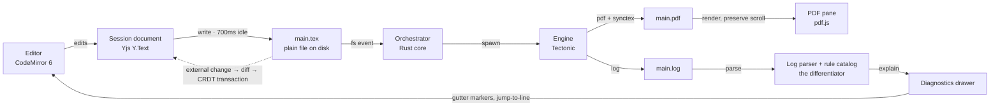

# Preamble

*(working name — see [`0.1/DESIGN.md`](0.1/DESIGN.md) §10)*

**A local-first LaTeX editor for people who write papers, not servers.**

Preamble is an open-source desktop LaTeX editor built on one idea: **compilation belongs on
the machine the author is already sitting at**, not on a shared queue somewhere else. Once that
is true, most of what makes hosted LaTeX painful — the queue wait, the compile-time cap, the
timeout on your thesis, the manuscript living in a database you do not administer — simply stops
existing. Everything else in the project is a consequence of that choice.

> **Status: sprint 1 (v0.1 in progress).** The skeleton exists and compiles a real paper on a
> machine with no TeX installation: open a folder, edit, see the PDF update. There is no
> installer yet; see *Building* below to run it from source. The full architecture, stack
> rationale and 16-sprint roadmap live in [`0.1/DESIGN.md`](0.1/DESIGN.md); the sprint plan and
> agent loops in [`0.1/SPRINTS.md`](0.1/SPRINTS.md); this README is the short version.

---

## Why this exists

Overleaf is really three products fused together — an editor, a compiler, and a filestore — and
you cannot take one without the other two. Preamble unbundles them:

- **The compiler is local.** A bundled [Tectonic](https://tectonic-typesetting.github.io/)
  engine compiles on your machine, with no TeX Live install to sit through first.
- **The editor is local.** A real writing environment, not a browser textarea with syntax
  colouring.
- **The filestore is a Git remote you already own.** GitHub, GitLab, Codeberg, a departmental
  server — anything that speaks Git. Backup, cross-device sync, history and async coauthoring all
  fall out of that one mechanism. We store nothing.

### The numbers behind "local"

| Stage            | Hosted    | Preamble (local, warm) |
| ---------------- | --------: | ---------------------: |
| sync / debounce  | 0.3 s     | 0.7 s *(keyboard idle)* |
| **queue wait**   | **1.5 s** | **—**                 |
| **container start** | **2.0 s** | **—**              |
| compile          | 6.0 s     | 0.8 s *(warm cache)*  |
| transfer / render | 0.7 s    | 0.06 s                |
| **Total**        | **~10.5 s** | **~1.6 s**          |

The bold rows are the whole argument: they are not inefficiencies a hosted service can engineer
away, they are what sharing a compile server costs. *(Figures are illustrative, to be replaced
with benchmark-corpus measurements once that exists.)*

---

## What makes it different

Once latency is solved, the editor still has to be worth using. Preamble spends its entire
remaining budget on three subsystems that serious LaTeX users currently work around with a pile
of external tools:

- **Errors are explained, not shown.** `! Missing $ inserted.` is a true statement that tells a
  first-time author nothing. Preamble resolves every diagnostic to a real `file:line` and
  rewrites it as a sentence about *your* document, with a one-click fix where the correction is
  unambiguous. The raw log stays one click away, forever — but it is never the default.
- **Citations without the browser.** Paste a DOI, arXiv ID or ISBN and the BibTeX entry appears,
  deduplicated against what you already have. Detect a running Zotero and link a collection.
  `\cite` completion shows author, year and title, not a bare key.
- **A prose assistant that edits in place.** Select a paragraph, choose an action (tighten,
  clarify, make consistent, explain this reviewer comment), get a diff, accept or reject it hunk
  by hunk. Bring your own API key. **The assistant can never introduce a citation that is not
  already in your `.bib`** — fabricated references are checked for and blocked before they reach
  the buffer.

Every AI feature has a non-AI path. With no API key and no network, the application is still
fully useful.

---

## What Preamble is *not*

These are stated non-goals, not missing features:

- **Not WYSIWYG.** Source on one side, PDF on the other. Rendering-as-you-type against real TeX
  semantics is a decade-long research problem, and it is not this project.
- **Not a TeX distribution.** We bundle an engine and detect existing ones. No package archives,
  no `tlmgr` competitor.
- **Not a cloud service.** Remote copies live in *your* Git remote, under your account, revocable
  by you.
- **Not a Zotero or Git replacement.** Both are excellent and entrenched. We integrate and
  reimplement nothing.
- **Not mobile.** Nobody writes a methods section on a phone.

---

## The compile loop

The whole application is one loop that runs a few times a minute for as long as you are writing.
Everything else is a panel attached to it.



A `.tex` file on disk is always the authoritative state — the CRDT is a session model, never a
storage format, which is what keeps the file plain and Git-clean. Uninstalling Preamble leaves
your paper completely intact and completely normal.

---

## Stack

| Layer            | Choice                        | Why                                                                 |
| ---------------- | ----------------------------- | ------------------------------------------------------------------- |
| Shell            | Tauri 2                       | Rust core, system WebView; ~10 MB bundle vs Electron's ~150 MB      |
| Core language    | Rust                          | Process orchestration, filesystem, log/bib parsing, Git            |
| Interface        | TypeScript + Svelte 5 *(open)* | Compile-time, no VDOM; must not fight CodeMirror for the DOM        |
| Editor           | CodeMirror 6                  | Holds a 400-page thesis without stutter; transactional state        |
| Language intel   | TexLab (LSP)                  | Mature LaTeX language server in Rust                                |
| Engine           | Tectonic, bundled             | Self-contained; makes "zero setup to first PDF" achievable          |
| Document model   | Yjs + y-codemirror.next       | A CRDT from sprint 1; cannot be retrofitted cheaply at v0.8         |
| PDF view         | pdf.js                        | Text layer gives search, selection and SyncTeX coordinate mapping   |
| Storage & history | libgit2 + GitHub API         | Real Git; the remote doubles as the filestore                       |
| AI               | Bring-your-own key            | Anthropic Messages API or any OpenAI-compatible endpoint            |

Full rationale, including what was rejected and why, is in [`0.1/DESIGN.md`](0.1/DESIGN.md) §4.

---

## Roadmap

Sixteen two-week sprints, each ending in something usable. **v0.3 is the release where this
stops being a hobby editor.**

| Version | Theme                              | Exit criterion (short)                                             |
| ------- | ---------------------------------- | ----------------------------------------------------------------- |
| v0.1    | It compiles                        | Edit a real paper, see the PDF update, on a machine with no TeX   |
| v0.2    | It navigates                       | Keyboard-drive a six-file thesis; click PDF → land on the source  |
| v0.3    | **It explains itself** *(the differentiator)* | A 20-error torture doc: every error → correct file, line and a plain-language explanation |
| v0.4    | It cites                           | Assemble a 40-reference paper without opening a browser           |
| v0.5    | It's fast                          | p95 warm recompile < 1.2 s on a 60-page TikZ/biblatex thesis, gated in CI |
| v0.6    | It syncs *(storage before convenience)* | Write on one machine, sync, clone on a second, lose nothing  |
| v0.7    | It assists                         | No fabricated citation can reach the buffer under adversarial prompting |
| v0.8    | It shares, live                    | Two authors edit one paragraph across a network; one goes offline and loses nothing |
| v0.9    | It ships                           | A stranger installs it on a clean machine and compiles their paper without reading anything |
| v1.0    | Public release                     | Announced                                                          |

Solo and part-time, plan for roughly double the ~7.5-month full-time estimate — and this project
doubles as how its maintainer is learning Rust, so v0.1–v0.2 in particular will run slower than
the baseline. That is expected.

---

## Building

Prerequisites: Rust stable (via [rustup](https://rustup.rs)), Node 22+ and pnpm, plus the
[Tauri 2 prerequisites](https://v2.tauri.app/start/prerequisites/) for your platform (on
Windows that is the MSVC Build Tools and WebView2, which Windows 11 already has; on Linux,
WebKitGTK 4.1).

```
pnpm install          # frontend dependencies
pnpm fetch-engine     # downloads Tectonic 0.17.0 for this machine into src-tauri/binaries/
pnpm tauri dev        # builds the Rust core, starts Vite, opens the window
```

Then `Ctrl O` and pick a folder with a `.tex` file in it — `fixtures/paper` is a good first one.
To open a folder on launch: `PREAMBLE_OPEN=fixtures/paper pnpm tauri dev`.

`pnpm verify` runs everything CI runs: Rust tests and clippy, `svelte-check`, Vitest.
`cargo test -p preamble-engine -- --ignored` compiles a fixture with the real engine.
[`.github/workflows/verify.yml`](.github/workflows/verify.yml) does all of that on Linux,
Windows and macOS for every push, and builds the app crate on each — run `pnpm build` first if
you want `cargo build -p preamble` to work locally, since the app embeds `dist/`.

Repository layout: `src-tauri/` is the Tauri app crate, `crates/` holds the engine wrapper,
the CRDT reconciler and the log parser as standalone crates, `src/` is the Svelte frontend,
`fixtures/` holds real documents for tests and manual smoke scripts. `CLAUDE.md` records the
conventions an agent (or a person) follows when working here.

---

## Licence

Proposed: **AGPL-3.0** for the application — it prevents a proprietary hosted fork, which is the
specific threat here. The reusable log parser and bibliography libraries will be published
separately under **MIT** so the wider TeX ecosystem can use them. To be confirmed in sprint 1.

## Platforms

Windows · macOS · Linux. No mobile, by design.
