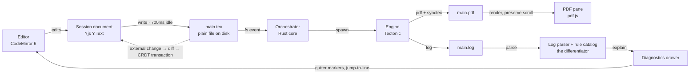

# Abstract-Tex

[](https://github.com/verocai-vrc/Abstract-Tex/actions/workflows/verify.yml)
[](LICENSE)


**A local-first LaTeX editor for people who write papers, not servers.**

Abstract-Tex is an open-source desktop LaTeX editor. It compiles on your own machine with a
bundled engine, so there is no TeX distribution to install, no compile queue and no timeout:
edit the source, pause, and the PDF beside it updates. When a build fails, you get a sentence
about *your* document that points at the right file and line, not a raw TeX log.

Your project stays a plain folder of `.tex` and `.bib` files. Abstract-Tex adds nothing to your
sources that another editor would not understand, and you can stop using it at any time without
converting anything.

> **Pre-release.** Abstract-Tex is under active development. There are no installers or tagged
> releases yet; to try it, build it from source as described in [Quick start](#quick-start).

---

## Features

### Compile without installing TeX

- A bundled [Tectonic](https://tectonic-typesetting.github.io/) engine builds your document. The
  LaTeX packages a document needs are downloaded on its first build and cached after that.
- The PDF rebuilds after 700 ms without typing and keeps your scroll position. A new edit
  cancels a build in progress instead of waiting behind it.
- Warm rebuilds run a single TeX pass and rerun BibTeX only when a citation changes: about 0.7 s
  for a two-column conference paper and 3.4 s for a sixty-page thesis on the maintainer's
  machines.
- Already have TeX Live or MiKTeX? A project can build with `pdflatex`, `xelatex` or `lualatex`
  instead (see [Project settings](#project-settings)).

### Errors you can act on

- Every error and warning is traced to the file and line that caused it, across multi-file
  projects, and explained in plain language.
- One-click fixes where the correction is unambiguous, applied as ordinary, undoable edits.
- Gutter markers and a diagnostics drawer you can group and filter. The raw log is always one
  click away, but never the default.

### Editing and navigation

- A CodeMirror 6 editor with LaTeX highlighting and tabs for open files.
- Completion, hover and go-to-definition from the bundled
  [TexLab](https://github.com/latex-lsp/texlab) language server.
- SyncTeX in both directions: jump from the cursor to its place in the PDF, or double-click the
  PDF to land on the source line.
- Multi-file projects: the root document is detected and `\input`/`\include` are followed.
- A document map of sections, figures, tables, labels and TODOs; a command palette; quick file
  open.
- Maths preview on hover, and focus and typewriter modes.
- Files changed by another program (another editor, a `git pull`) are picked up. If you have
  unsaved edits to the same file, you are asked; nothing is merged silently.

### Citations

- `\cite` completion shows author, year and title, not only the key.
- Paste a DOI, arXiv ID or ISBN into the editor to get a `\cite` and a new BibTeX entry,
  checked against the entries you already have so nothing is duplicated.
- Zotero: a running Zotero with [Better BibTeX](https://retorque.re/zotero-better-bibtex/) is
  detected, and a collection's auto-exported `.bib` can be linked to the project.
- Continuous bibliography checks: undefined citations, entries never cited, duplicate DOIs,
  missing required fields, the wrong dash in a page range.

### Yours, on your machine

- No account and no telemetry. After a document's packages are cached, writing and compiling
  work offline; only looking up a pasted DOI, arXiv ID or ISBN needs the network.
- Build output goes to a hidden `.abstract-tex/` folder inside the project. Settings, if you
  need any, go in one small `abstract-tex.toml`.

---

## How it works

The whole application is one loop that runs a few times a minute for as long as you are writing.
Everything else is a panel attached to it.



The `.tex` file on disk is always the authoritative copy. The in-memory document model exists
only while the app is open and is never a storage format, which is what keeps your files plain
and friendly to Git.

Abstract-Tex is built with [Tauri 2](https://v2.tauri.app/) and Rust for the core, and Svelte 5,
CodeMirror 6, Yjs and pdf.js for the interface.

---

## Versions

The current version is **0.1.0**, unreleased: no version has been tagged yet, and `main` is the
development line. Work is organised in milestones, each ending in something usable.

| Milestone | Theme | Status |
| --- | --- | --- |
| v0.1 | **It compiles**: edit a paper and see the PDF update, with no TeX installed | Implemented, in pre-release testing |
| v0.2 | **It navigates**: language server, SyncTeX, multi-file projects, command palette | Implemented, in pre-release testing |
| v0.3 | **It explains itself**: every error traced to its file and line and explained in plain language | Implemented, in pre-release testing |
| v0.4 | **It cites**: citation completion, paste-to-cite, Zotero, bibliography checks | Implemented, in pre-release testing |
| v0.5 | **It's fast**: single-pass warm builds, system TeX engines, a performance gate in CI | In progress |
| v0.6 | **It syncs**: history and sync through any Git remote, conflicts shown as plain paragraphs | Planned |
| v0.7 | **It assists**: an optional prose assistant using your own API key, unable to invent citations | Planned |
| v0.8 | **It shares, live**: real-time co-editing through a self-hostable relay | Planned |
| v0.9 | **It ships**: signed installers and auto-update | Planned |
| v1.0 | Public release | Planned |

Bundled components: Tectonic 0.17.0 (TeX engine) and TexLab 5.26.0 (language server).

---

## Quick start

There are no installers yet, so Abstract-Tex runs from source.

**Prerequisites**

- [Rust](https://rustup.rs), stable (the repository pins the channel in `rust-toolchain.toml`)
- [Node.js](https://nodejs.org) 22 or newer, and [pnpm](https://pnpm.io)
- The [Tauri 2 prerequisites](https://v2.tauri.app/start/prerequisites/) for your platform: on
  Windows, the MSVC Build Tools and WebView2 (Windows 11 already has it); on macOS, the Xcode
  Command Line Tools; on Linux, WebKitGTK 4.1 and its development packages

You do **not** need a TeX distribution.

```sh
git clone https://github.com/verocai-vrc/Abstract-Tex.git
cd Abstract-Tex
pnpm install
pnpm fetch-sidecars   # downloads Tectonic and TexLab for this machine into src-tauri/binaries/
pnpm tauri dev        # compiles the app and opens its window
```

The first `pnpm tauri dev` compiles the Rust core, which takes a few minutes. Then:

1. Press `Ctrl+O` (`⌘O` on macOS) and choose a folder containing a `.tex` file.
   [`fixtures/paper`](fixtures/paper) in this repository is a good first one.
2. The PDF appears on the right. The first build of a document downloads the LaTeX packages it
   uses, so it needs a network connection and takes longer than the builds after it.
3. Edit some text, pause, and watch the PDF update. `Ctrl+B` or `F5` builds straight away.

To open a folder at launch, give its **absolute** path:

```sh
ABSTRACT_TEX_OPEN="$PWD/fixtures/paper" pnpm tauri dev
```

---

## Usage

### Keyboard shortcuts

`Mod` is `Ctrl` on Windows and Linux and `⌘` on macOS.

| Shortcut | Action |
| --- | --- |
| `Mod+S` | Save |
| `Mod+B` or `F5` | Build now |
| `Mod+O` | Open folder |
| `Mod+P` | Go to file |
| `Mod+K` | Command palette: every action, file and section |
| `Ctrl+Alt+J` | Show the cursor's position in the PDF |
| `Alt+F12` | Go to definition |
| Double-click in the PDF | Jump to that line in the source |
| `Ctrl` + mouse wheel over the PDF | Zoom |

### Project settings

Most projects need no configuration. The root document is found automatically: `main.tex` if
there is one, otherwise the `.tex` file with a `\documentclass` that no other file includes.
Double-clicking a `.tex` file in the file tree makes it the root.

When a project does need settings, they live in `abstract-tex.toml` in the project folder:

```toml
[project]
root = "thesis.tex"     # the document to build, relative to this folder
engine = "xelatex"      # "tectonic" (the default, bundled), "pdflatex", "xelatex" or "lualatex"
extra_bib_files = ["zotero/my-collection.bib"]   # written for you when you link a Zotero collection
```

`pdflatex`, `xelatex` and `lualatex` run through `latexmk` from a TeX Live or MiKTeX installation
on your `PATH`, which also brings Biber. If none is found, Abstract-Tex says so and builds with
the bundled engine instead.

### Known limitations

- The bundled engine does not include Biber. Use `biblatex` with `backend=bibtex`, or switch the
  project to a system engine.
- Shell escape is disabled, so packages that run external programs, such as `minted`, do not
  build yet.
- With the bundled engine, `fontspec` finds fonts by file name (`\setmainfont{FreeSerif.otf}`),
  not by family name (`\setmainfont{DejaVu Serif}`).
- There are no installers, and Git sync, the assistant and live collaboration are not built yet
  (see [Versions](#versions)).

---

## What Abstract-Tex is not

These are deliberate choices, not missing features:

- **Not WYSIWYG.** Source on one side, PDF on the other.
- **Not a TeX distribution.** It bundles one engine and uses the ones you already have; it does
  not manage packages.
- **Not a cloud service.** Nothing is stored anywhere but your machine and, later, a Git remote
  you choose.
- **Not a replacement for Zotero or Git.** It works with both.
- **Not for mobile.**

---

## Libraries

Two parts of Abstract-Tex are standalone Rust crates under the MIT licence, so other TeX tools
can use them:

- [`texlog`](crates/texlog): parses a TeX `.log` into diagnostics with a file, a line, a
  plain-language explanation and, when the correction cannot be wrong, a fix.
- [`texbib`](crates/texbib): parses BibTeX and BibLaTeX files without losing anything as written,
  with bibliography checks and optional DOI, arXiv and ISBN lookup.

Both are ready for crates.io but not yet published there.

---

## Development

`pnpm verify` runs the full test gate: Rust tests and clippy, `svelte-check`, and Vitest. CI runs
it on Linux, Windows and macOS for every push. Build details, the repository layout, the
architecture and the development plan are in [DEVELOPMENT.md](DEVELOPMENT.md).

Bug reports and suggestions are welcome as
[GitHub issues](https://github.com/verocai-vrc/Abstract-Tex/issues).

---

## License

Abstract-Tex is licensed under the [GNU Affero General Public License v3.0](LICENSE). The
`texlog` and `texbib` crates are licensed under MIT; see the `LICENSE` file in each crate.
